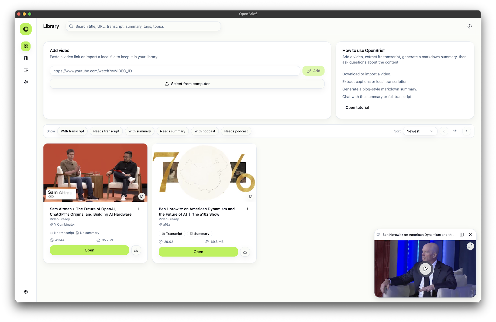
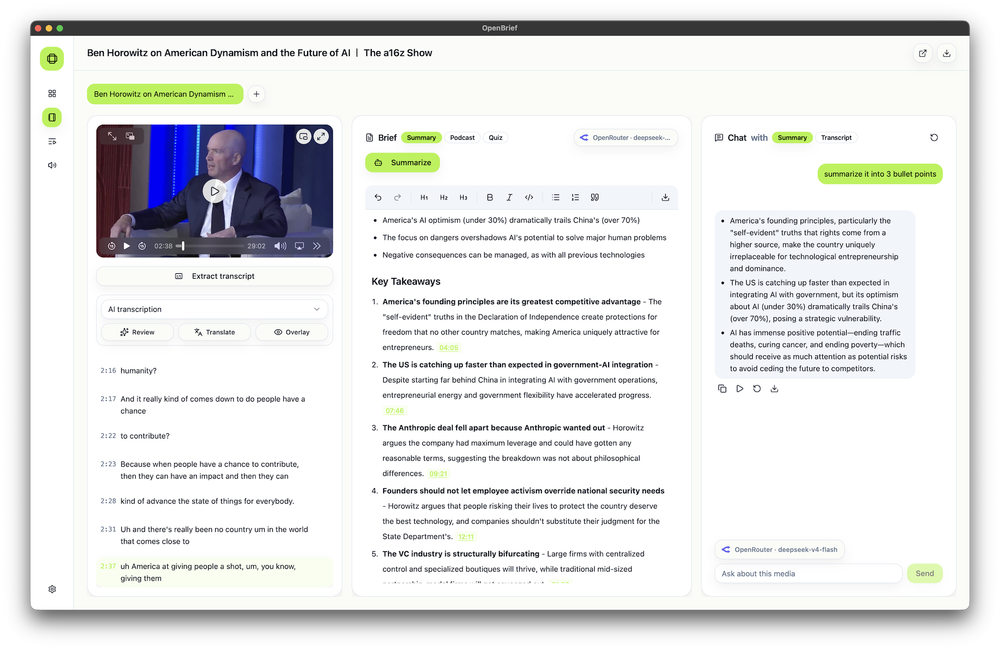

<div align="center">

# OpenBrief

**Turn videos and audio into clear, listenable briefings.**

Import a video or audio file, extract its transcript, generate a grounded summary, and chat with the content — all on your desktop.

[](LICENSE)
[](https://tauri.app)

[](https://github.com/tantara/openbrief/stargazers)

[Watch the demo](https://youtu.be/OnS3EViayRo) · [Features](#features) · [Model Support](#model-support) · [Setup](#setup) · [Development](#local-development) · [Roadmap](#roadmap)

[](https://youtu.be/OnS3EViayRo)

</div>

OpenBrief is a pnpm/Turborepo workspace centered on a Tauri v2 desktop app. It supports importing local media or video URLs, downloading media through bundled tools, transcribing audio, generating grounded summaries, chatting with media context, organizing playlists, and exporting reusable notes.

## Features

- 📥 **Import anything** — paste a video link or import a local audio/video file.
- ✍️ **Transcribe locally** — extract captions or run on-device speech-to-text.
- 📝 **Grounded summaries** — generate blog-style markdown briefs with timestamped takeaways.
- 💬 **Chat with media** — ask questions against the summary or full transcript.
- 🔊 **Listen back** — turn summaries into audio with text-to-speech.
- 🔒 **Open source & private** — runs on your machine, free to use.

Build a searchable library from video links or local files, then extract transcripts and keep everything in one place.



Open any item to read the transcript, generate a grounded summary, and chat with the media context side by side.



## Model Support

| Model type | Supported | TODO |
| --- | --- | --- |
| Speech to text | Whisper, Parakeet, Qwen3-ASR | None |
| Text to speech | Supertonic 3, Qwen3-TTS | None |
| Large language model | OpenAI GPT, Anthropic Claude, Google Gemini, OpenRouter DeepSeek | Local Gemma 4 |
| Video embedding | None | Frame and clip embeddings for semantic search |

## Repository Layout

```text
client/
  apps/
    tauri/            Main OpenBrief desktop app
      src/            React renderer, feature UI, domain logic, services, hooks, i18n
      src-tauri/      Tauri v2 Rust boundary, commands, helper sidecar, packaging
      scripts/        Helper-sidecar and media-tool preparation scripts
    nextjs/           Web app and download/YouTube routes
    tanstack-start/   TanStack Start app shell
    expo/             React Native app shell
    workers/          Worker entry points
  packages/
    api/              Shared API routing
    auth/             Authentication integration
    db/               Database schema and access
    ui/               Shared UI components
    validators/       Shared validation helpers
  tooling/
    eslint/           Shared ESLint config
    github/           GitHub setup helpers
    prettier/         Shared Prettier config
    tailwind/         Shared Tailwind config
    typescript/       Shared TypeScript config

AGENTS.md             Repository development guidance
DESIGN.md             Product and UI direction
```

## Requirements

- Node.js `^22.21.0`
- pnpm `11.0.9`
- Rust and Cargo
- Tauri v2 platform prerequisites for your OS

Use the package manager declared in `client/package.json`.

## Setup

Install dependencies from the workspace root:

```bash
cd client
pnpm install
```

If pnpm reports ignored native build scripts on a fresh machine, run `pnpm approve-builds`, approve the listed native/tooling packages, then rerun `pnpm install`.

Create local environment values when needed:

```bash
cp .env.example .env
```

## Local Development

Use two terminals from `client/` when working on both the web app and desktop app:

```bash
pnpm dev:next
```

The Next.js app runs at `http://localhost:3000`.

```bash
pnpm dev:tauri
```

The Tauri dev command builds the helper sidecar, starts the desktop renderer through Vite at `http://localhost:1420`, compiles the Rust app, and launches the desktop window.

## Desktop App

Run the Tauri desktop app:

```bash
cd client
pnpm dev:tauri
```

Run only the renderer during frontend work:

```bash
cd client/apps/tauri
pnpm dev
```

Build frontend assets:

```bash
cd client/apps/tauri
pnpm build
```

Build or refresh bundled helper/media assets:

```bash
cd client/apps/tauri
pnpm setup:dev-sidecars
pnpm prepare:media-assets
```

Useful desktop checks:

```bash
cd client/apps/tauri
pnpm test:run
pnpm typecheck
cd src-tauri && cargo check
```

## Web And Shared Workspace

Run the Next.js app:

```bash
cd client
pnpm dev:next
```

Run all workspace dev tasks through Turbo:

```bash
cd client
pnpm dev
```

Common workspace checks:

```bash
cd client
pnpm typecheck
pnpm lint
pnpm build
```

Database and auth helpers:

```bash
cd client
pnpm db:push
pnpm db:studio
pnpm auth:generate
```

Use `pnpm --filter <workspace> <script>` or `pnpm -F <workspace> <script>` for a single app or package.

## Roadmap

- [x] Improve audio file support for transcription, summaries, playback, and exports.
- [ ] Support more document and web source types, including PDFs, HTML pages, and other document formats.
- [x] Support Parakeet ASR.
- [x] Support Qwen3-ASR and Qwen3-ForcedAligner.
- [x] Support Supertonic 3 TTS.
- [ ] Support local LLMs, including Gemma 4.
- [ ] Add video embedding for frame and clip semantic search across the library.
- [ ] Add voice cloning so summaries can be read aloud in a selected voice.
- [ ] Share summaries through the web and mobile apps.
- [ ] Support more artifact formats, including flashcards and other reusable study or publishing outputs.

## Acknowledgements

OpenBrief builds on and takes inspiration from several projects:

- [yt-dlp](https://github.com/yt-dlp/yt-dlp) for video download support.
- [whisper.cpp](https://github.com/ggml-org/whisper.cpp) and [transcribe-rs](https://github.com/cjpais/transcribe-rs) for local speech-to-text.
- [FluidAudio](https://github.com/FluidInference/FluidAudio) for local Apple-platform audio AI inspiration.
- [Qwen3-ASR](https://github.com/QwenLM/Qwen3-ASR) for speech recognition model support.
- [Qwen3-TTS](https://github.com/QwenLM/Qwen3-TTS) for text-to-speech model support.
- [Supertonic](https://github.com/supertone-inc/supertonic/) for Supertonic 3 TTS support.
- [tweakcn](https://tweakcn.com/themes/cmlhfpjhw000004l4f4ax3m7z) for the shadcn theme.
- [Voicebox](https://github.com/jamiepine/voicebox) and [Anarlog](https://github.com/fastrepl/anarlog) for product and implementation inspiration.

## License

OpenBrief is licensed under the [GNU Affero General Public License v3.0](LICENSE).

## Verification

Run the smallest check that proves the change, then widen as needed:

```bash
cd client/apps/tauri && pnpm test:run <pattern>
cd client/apps/tauri && pnpm typecheck
cd client/apps/tauri/src-tauri && cargo check
cd client && pnpm --filter @acme/nextjs typecheck
git diff --check
```

For packaging, run the relevant Tauri build on the target platform before making release claims.
